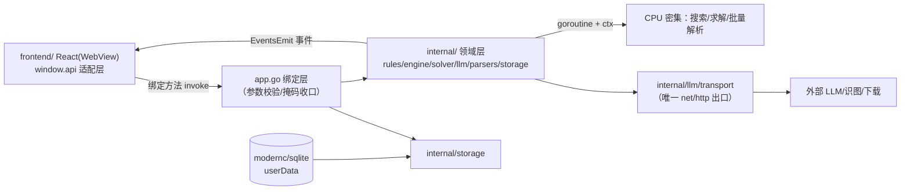

# 00 总体架构与技术选型（Go 版）

> 与 Electron 版 `design_docs/00-总体架构与技术选型.md` 的关系：Electron 版为双进程（main/preload/renderer/Worker）+ IPC；
> Go 版为**单进程分层**（Wails 绑定边界）。本文是 Go 版架构事实源；Electron 版 §1.2 Flutter→Electron 映射表、§5 安全清单中
> 与进程模型无关的条目继续有效。

## 1. 技术选型

### 1.1 选型矩阵

| 决策项 | 采纳 | 弃用候选与理由 | DR |
|---|---|---|---|
| 桌面框架 | Wails v2（原生 WebView） | Fyne（UI 全重写）、Wails v3（alpha）、浏览器（非桌面） | DR-001 |
| 前端 | React 18 + TS strict + Vite + Zustand（移植） | 重写为其他框架（无收益） | DR-001 |
| 领域语言 | Go 1.23+，`internal/` 纯 Go 包 | Rust napi（无意义）、TS 复用（违背重写目标） | — |
| 并发 | goroutine + context | 独立进程（过度设计） | DR-003 |
| HTTP | `internal/llm/transport` 收口 net/http + bufio SSE | 前端直连（凭据/CORS）、自建代理进程（过度） | DR-004 |
| 数据库 | modernc.org/sqlite | mattn（CGO） | DR-002 |
| 设置/凭据 | JSON 文件（应用配置）/ OS keyring + 0600 回退 | electron-store/safeStorage（平台绑定） | — |
| 测试 | go test（+race）+ 金标准对拍；Vitest（前端）；Playwright（浏览器 mock E2E） | — | — |
| 打包 | wails build + GitHub Actions 矩阵 | goreleaser（Wails 前端资源处理不匹配） | — |

### 1.2 Electron 版 → Go 版技术映射

| Electron 版 | Go 版 | 说明 |
|---|---|---|
| main 进程 services | `internal/*` + 根包 `app.go` 绑定方法 | 单进程；服务即结构体方法 |
| preload（contextBridge） | Wails 自动生成的 JS 绑定（`wailsjs/go/...`） | `window.api` 形状由适配层维持 |
| ipcMain 通道（cc:*） | 绑定方法（invoke）+ `EventsEmit`（事件） | 语义同构，见 §3 |
| Web Worker（engine/solver/parser） | goroutine + context | 消息形状保留 |
| better-sqlite3 | modernc.org/sqlite | Schema 逐字段一致 |
| electron-store | JSON 配置文件（userData 目录） | 键名沿用 `llm_settings_*` |
| safeStorage 三槽位 | keyring 三条目 + credentials.enc 0600 回退 | 槽位名沿用 |
| tools/eval.ts | `cmd/eval/main.go` | 同参数面 |

## 2. 单进程分层模型



各层职责与禁止（对齐 Electron 版 §2 职责-禁止表）：

| 层 | 职责 | 禁止 |
|---|---|---|
| frontend/ | UI 渲染、动画、状态（Zustand 每局一实例）、api 适配层 | 直接 fetch 外部 URL；实现领域逻辑 |
| app.go 绑定层 | Wails 方法/事件装配、生命周期、userData 路径 | 领域逻辑 |
| internal/ | 规则/引擎/求解/LLM 协议/解析/存储，纯 Go | import Wails/net/http/frontend（llm/transport 除外——net/http 仅许在该包） |

## 3. 绑定方法与事件协议（替代 Electron 版 §3 IPC 通道表）

### 3.1 通道映射总则

- Electron 版 `cc:*` 通道 → Go 版**绑定方法**（invoke 类）与 **EventsEmit 事件**（push 类）。
- 命名：方法 = `LlmChat / LlmCancel / DbSaveGame / CorpusDownload …`（Wails 生成 `window.go.app.App.LlmChat`）；
  事件 = `llm:chunk / llm:done / llm:error / download:progress / app:lifecycle …`。
- 前端适配层 `frontend/src/api/`：实现与 Electron 版 `window.api` **完全相同的 TS 接口**（`ipc/client.ts` 调用形状不变），内部改调 Wails 绑定与 `EventsOn`。UI 组件零改动。

### 3.2 通道清单

| Electron 通道 | Go 形态 | 载荷要点 |
|---|---|---|
| cc:llm:chat | `App.LlmChat(req) error`（阻塞至结算后恒 resolve——对齐 Electron ipc handler 的 `proxy.chat` await 语义；前端 llmTransport 以 promise 结束反注册事件订阅，依赖此语义） | `{requestId,url,headers,body}`；结局走事件 |
| cc:llm:chunk/done/error | 事件 `llm:chunk`/`llm:done`/`llm:error` | `{requestId, delta|text|message}` |
| cc:llm:cancel | `App.LlmCancel(requestId)` | context cancel，幂等 |
| cc:llm:testConnection | `App.LlmTestConnection(cfg)` | 同步返回结果 |
| cc:vision:readBoard | `App.VisionReadBoard(cfg, imageB64)` | 多模态非流式 |
| cc:db:* | `App.DbSaveGame / DbLoadLatest / DbDeleteForMode / Records*` | — |
| cc:store:get/set | `App.StoreGet(key) / StoreSet(key,val)` | JSON 配置文件 |
| cc:secure:* | `App.SecureGet/Set/Delete(slot)` | keyring；掩码回读 |
| cc:corpus:* | `App.Corpus*` 系列 + `corpus:progress` 事件 | 下载进度/扫描/索引 |
| cc:dialog:* | `App.DialogSaveFile / DialogReadFile` | Wails 原生对话框 |
| cc:clipboard | `App.ClipboardWrite(text)` | — |
| cc:app:lifecycle | 事件 `app:lifecycle` | blur/close/before-quit |
| engine/solver/parser Worker | `App.EngineFindBestMove(...)` 等，内部 goroutine + ctx | `{id,type,payload}` 消息形状在内部协议保留 |

### 3.3 requestId 取消规范（照搬 Electron 版 §3.2）

- 每个异步请求带 UUID requestId；新局/悔棋/离开页面/暂停 → 调用对应 Cancel 方法（内部 `context.CancelFunc`）。
- 迟到响应（事件）按 requestId 在**前端适配层**丢弃（等价 `_gameSeq`）；Go 侧同时保证取消后不再发任何事件。
- 输入锁在失败/取消/dispose 时必须解锁（08 防错清单）。

## 4. 目录结构与分层原则

```text
chinese_chess_go/
├── AGENTS.md  README.md  go.mod  wails.json  main.go  app.go
├── design_docs/            # 本文档集
├── docs/PROGRESS.md        # 进度记录
├── internal/               # ★ 纯 Go 领域层（铁律 #1：禁 import Wails/net/http/frontend）
│   ├── rules/              # 棋盘/走法/胜负/记法/L3 重复裁决
│   ├── engine/             # 搜索/评估/Zobrist(L0)/L1/L2/MatchRunner
│   ├── solver/             # AND/OR 求解器
│   ├── llm/                # prompt/parser/annotation/config/transport(SSE)/player/hybrid/vision
│   ├── parsers/            # iccs/pgn/xqf
│   └── storage/            # sqlite DAO/设置/凭据/存档 JSON
├── cmd/eval/main.go        # MatchRunner CLI（LLM_BASE_URL/LLM_MODEL 环境变量）
├── frontend/               # 移植的 React（src/api 适配层 + mock 适配器）
├── testdata/golden/        # fen.json / moves.json / notation.json / engine.json（复制自 Electron 版 tools/golden）
├── build/                  # Wails 打包资源（提交）；build/bin 产物（忽略）
└── .github/workflows/      # ci.yml / release.yml
```

分层原则一句话：`internal/*` 全部纯 Go（无 Wails/无网络依赖，transport 除外且仅限该包），保证三处复用——Wails 绑定调用、`go test` 直跑、cmd/eval CLI 直跑。

## 5. 安全清单（沿 Electron 版 §5，去除进程边界项）

- API Key：keyring 加密；回退文件 0600；日志/异常/UI 掩码 `****`+末4位。
- WebView：Wails 默认禁 DevTools 于生产构建；前端禁外链 fetch（CSP 由 Wails 注入 `connect-src 'self'`）。
- 下载安全：仅 HTTPS + 域名/私网/环回/mDNS/IPv4-mapped 拒绝（SSRF 白名单），zip-slip 防护（条目名归一化后越界/盘符/UNC/保留名跳过）——逐条沿 Electron 版 06 §5。
- 版本号：`go build -ldflags "-X main.version=..."` 注入，Release tag 对齐。

## 6. 开发环境工作流（WSL）

- 依赖：Go 1.23+、Node 20、`wails v2` CLI、`libgtk-3-dev libwebkit2gtk-4.0-dev`（WSLg 窗口）。
- `wails dev` 弹窗；`npm run dev:web`（mock api 适配层）用于无窗口开发与 Playwright E2E。
- WSLg webkit 若出现渲染异常（风险 R7'）：前端工作全部退到浏览器模式；Go 侧工作不依赖窗口。

## 7. 不迁移清单（沿 Electron 版附表）

pikafish_bridge、engine_view_model、hint_strategy 等空壳桩不迁移；对局设置页、全局设置、棋谱库等 UI 按移植清单（08 §1）。
