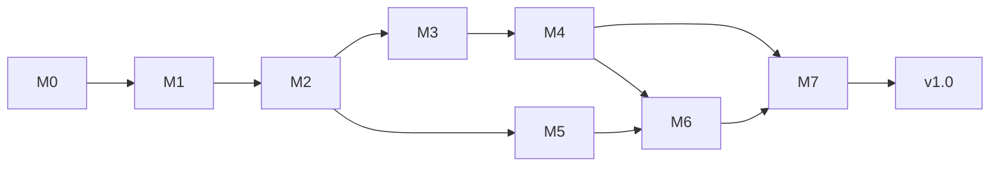

# 10 实施路线图（Go 版）

> 里程碑按依赖排序；**与 Electron 版 10 文档的最大差异：重复变招治理（electron-DR-018/019）不再后置，随各域首版落地（DR-006）**。

## 1. 里程碑

| 里程碑 | 内容 | 验证门 | 依赖 |
|---|---|---|---|
| **M0 工程骨架** | go.mod + Wails v2 初始化 + 目录结构（internal/frontend/cmd/testdata）+ frontend 从 Electron 版移植（api 适配层 + mock 适配器）+ CI 骨架（三平台 gofmt/vet/test -race + 前端 vitest） | `wails dev` WSLg 弹窗；浏览器 mock 模式可开发；CI 三平台全绿 | — |
| **M1 规则内核 + L3** | internal/rules（Board/FEN/走法/胜负/记法）+ **L3 JudgeRepetition 纯函数**；金标准 fen/moves/notation 复制入 testdata/golden 并全绿 | 17+5 规则用例 + 金标准对拍全绿；L3 三类环裁决用例全绿 | M0 |
| **M2 对战页 + 存储** | internal/storage（sqlite DAO/设置/凭据）+ GameVm（**fenHistory 四收口点**、agreeDraw/resign(draw)）+ 双人页 + 主页导航 + **UI 裁决接线（双人页）** | 双人完整对局；存档恢复/死局清理；fenHistory 四收口测试；悔棋回滚裁决状态 | M1 |
| **M3 引擎 + L0/L1/L2** | internal/engine（逐行翻译 TS 版）+ **Zobrist 内置 + L1 搜索内检测 + L2 根节点回避** + ChessAiPlayer（goroutine）+ 人机对战页（可执黑、引擎类型可选）+ **UI 裁决接线（人机页）** | **先**：不传 HistoryFens 时 engine.json 对拍逐位一致 → **后**：开 L1/L2（惩罚精确值/nodeCount ≤5%/回避场景）；性能门难度 5 ≤7.5s；cancel 语义 | M2 |
| **M4 LLM 全链路** | internal/llm（prompt/parser 逐字 + **恒关思维链** + transport SSE + LlmPlayer/HybridLlmPlayer）+ 人机 LLM 页 + LLM vs LLM 页 + 配置卡（keyring）+ **UI 裁决接线（LLM 两页）** | mock SSE 全场景（含 thinking 参数断言）；真实端点手测一整局；否决链用例 | M3 |
| **M5 语料 + 棋谱** | internal/parsers（ICCS/PGN/XQF）+ 语料库页 + 下载器（SSRF/zip-slip）+ 棋谱库/重放/导出/进入对战 | 样例解析；大文件索引分页行为一致；PGN 导出快照 | M2（棋谱）/M1（解析） |
| **M6 工作室 + 求解器 + 识图** | internal/solver（goroutine + ctx）+ 工作室三 Tab + LLM 求解辅助 + 视觉识图 + 演示播放器 | 6 验证 FEN；识图人工校正流；联动对战 | M4/M5 |
| **M7 评估 + 打包发布** | cmd/eval MatchRunner（4 profile）+ 三平台打包（wails build + nfpm/AppImage/NSIS/dmg）+ CI 矩阵（缓存）+ Release 上传 | 四 profile 报告可产出；三平台安装包启动冒烟 | 全部 |

每验证门 = 09 质量门四项全绿 + 里程碑专属验收用例 + **用户手动验收（11 §里程碑验收流）**。

## 2. 分支与提交策略

沿 Electron 版 §4：main 保护、`feature/mN-*` 模式、合入打 tag（`v0.x.0-mN`，M7 为 `v1.0.0`）；DR 随实现同 commit（`Decision: DR-xxx`）。

## 3. 风险表

| # | 风险 | 影响 | 缓解 |
|---|---|---|---|
| R1' | ~~原生模块 ABI~~（modernc 纯 Go 已消除）；**替代风险：Linux 打包依赖（WebKitGTK/nfpm/AppImage 工具）** | M0/M7 | CI runner apt 预装；打包工具 M7 预研裁决定案 |
| R2 | Go 引擎行为漂移（剪枝形态敏感，对拍失败难归因） | M3 | 逐行翻译 TS 版（铁律 #9）；先对拍后开 L1/L2；-race 兜底 |
| R3 | Key/凭据泄漏 | M4 | 包边界收口（DR-004）；keyring+0600；掩码铁律 #8 |
| R4 | SSE 行重组/背压 | M4 | bufio.Scanner 大缓冲按行；requestId 关联；计时器在 Go 侧 |
| R5 | 大语料（97MB PGN / 2911 XQF）卡 UI | M5 | 流式索引 + goroutine 分批 128 + generation 防陈旧 |
| R6 | XQF 解密实现偏差 | M5 | 2911 真实文件批量回归（失败率 ≤ Dart 版）+ 测试侧往返构造器 |
| R7 | WSLg WebKitGTK 渲染差异（GPU/托盘） | M0 | 浏览器 mock 模式兜底；前端工作不依赖窗口 |
| R8 | ~~LLM 对战重复死锁~~ | — | **已被 DR-006 前置实现消化**（L1/L2/L3 随 M1-M3 落地） |
| R9 | React 移植回归（api 形状失配） | M0/M2 | 适配层接口形状不变 + Electron 版 vitest UI 用例随迁 + mock 适配器对拍 |

## 4. 打包工具候选（M7 裁决定案，先预置）

| 平台 | 候选 | 备注 |
|---|---|---|
| Windows | wails build -nsis（内置 NSIS 模板） | 产物 Setup.exe |
| macOS | wails build（.app）+ hdiutil/create-dmg 转 dmg | x64+arm64 |
| Linux | nfpm（deb）+ linuxdeploy/appimagetool（AppImage）；最小兜底=裸二进制 tar.gz | runner 需 libgtk-3-dev libwebkit2gtk-4.0-dev |
| CI 缓存 | go-build（~/.cache/go-build）、模块（~/go/pkg/mod）、wails CLI/nsis 工具 | key 随 go.sum 失效；发布沿用"矩阵产包→artifact→汇总上传 Draft Release"（已验证模式） |

> **M7 落地注记（T7.2）**：定案已实现为 `.github/workflows/release.yml`（tag v* 触发：三平台矩阵
> lint+test+build → artifact → `gh release create --draft` 汇总上传）与 `build/nfpm.yaml`、
> `build/linux/build-appimage.sh`、`build/linux/chinese-chess-ultra-go.desktop`（+512px 图标副本，
> linuxdeploy/hicolor 仅接受标准分辨率图标）。Linux 依赖按 CI 同口径装 **libwebkit2gtk-4.1-dev**
> 并以 `-tags webkit2_41` 构建（webkit2gtk-4.0 已从 Ubuntu 24.04+ 源移除，R1' 缓解、沿 ci.yml——
> 上表 "4.0" 字样为预置期旧口径）；AppImage 产物名由 desktop 文件 Name 字段驱动，脚本统一改名
> 发布名。dmg 取 hdiutil 路线（create-dmg 弃用：brew 依赖多余）；nfpm 固定 deb 单一格式（rpm 弃
> 用：用户面单一）。Go test 全平台 -race（Windows runner 预装 MinGW 可跑；初版误判"无 CGO 工具链"已纠正，DR-012）。

## 5. 验收基线（DoD for v1.0，对齐 Electron 版四条）

1. Electron 版 01 文档 E-F01~F42 全部功能可用（含 Go 版两处差异：重复裁决前置、思维链强制关闭）；
2. 09 质量门全绿 + 三平台安装包；
3. 真实 LLM 端点手测：人机 LLM 一整局 + LLM vs LLM 一整局 + 求解辅助一次 + 识图一次（全程思维链关闭生效）；
4. MatchRunner 四 profile 报告可复现（与 Electron 版结论同数量级：候选/护航模式失误率 ≈0%）。
